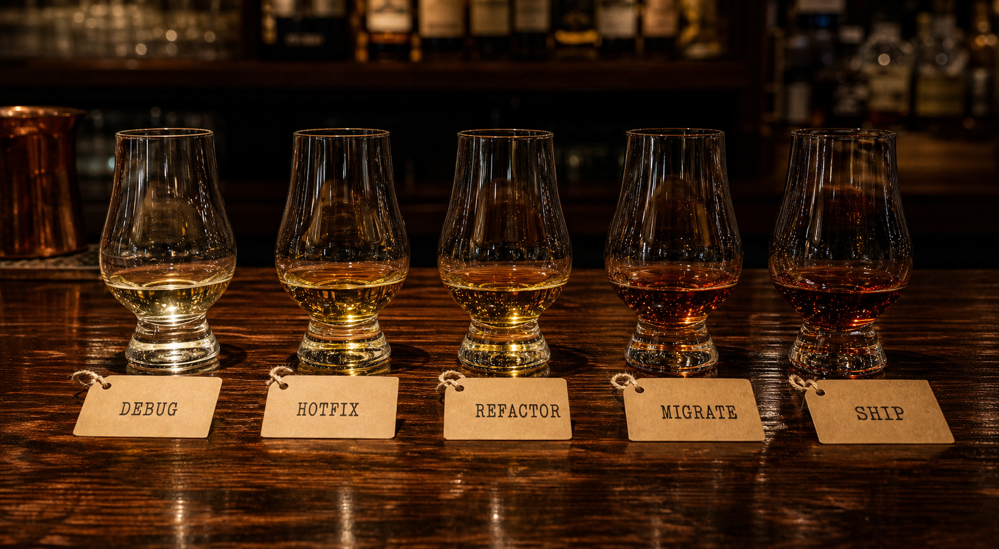

<div align="center">


# 🥃 whisky-finish

**Every piece of work deserves a proper last sip.**

When the work is done, your agent picks a whisky that matches the job,<br/>
pours a dram, and writes the tasting note.

`Nose` · `Palate` · `Finish` — for code and whisky alike, the finish is everything.

</div>

---

## Why

Run enough agent sessions overnight and two things go missing: **the sense of an ending**, and **the answer to "wait — did this session finish?"**

whisky-finish brings both back. When the work ends, the glass gets filled. When the session ends, the bell gets rung.

## What it does

### 1. The Pour — work's done, pour one

When a task wraps up, the agent picks a **real, specific bottling** that matches the character of the work — then writes an NPF tasting note: half whisky, half retrospective.

<div align="center"></div>

> ## 🥃 Dram #3 — Ardbeg Uigeadail (54.2%, NAS, ex-bourbon + oloroso, NCF)
> *2026-07-29 · after: race condition in the job queue · neat, Glencairn, 3 drops of water*
>
> **Nose:** Tarry rope and sherry-soaked raisins — a prod incident at 2am, but one that ends well.<br/>
> **Palate:** Oily, ashy peat over dark fruit. The bug was ugly; the fix was one mutex.<br/>
> **Finish:** Endless, warm, faintly sweet. So is the regression test left behind.
>
> **Verdict:** 92/100. Earned.

<div align="center"></div>

There is no pairing chart. The agent reads the session — the weight of it, the pain, the elegance, how long it dragged — and pours on instinct. A hellish debugging night might land on a peat monster; a clean refactor on something precise and waxy; a weird hack that somehow worked on something equally weird. Or not. That's the bartender's call, and the tasting note is where the call gets defended.

Every pour is still **uncompromisingly specific** — distillery, expression, ABV, cask program. There is no "some nice Islay" at this bar. And every pour lands on the tab: `.whisky/tab.md`.

New to whisky? The bartender meets you where you are. A Kakubin highball 1:4, tall glass packed with ice, lemon peel — a highball is a first-class serve here, not a downgrade.

<div align="center"></div>

### 2. The Bar — ask the bartender anything

Regions, distilleries, cask chemistry, entry-level ladders, how to read a label. And when you say **"one more"** — a new bottle gets poured, and the tab count goes up by one.

```
> what's a good starter Islay?
> what does a sherry cask actually do?
> one more
```

### 3. Last Call — closing the session

<div align="center"></div>

Run enough sessions and it gets blurry. *Is this one... finished?*

Now you just ring the bell:

```
> last call
```

This writes `.whisky/LAST-CALL.md` — closing time, drams poured, the final pour, and a one-line summary of what got done. Later, when anyone (human or agent) asks whether this session ended, that file answers.

> *This session is over. The bar is closed.*

## Install

```bash
# via the skills CLI (recommended — skills.sh ecosystem)
npx skills add choism4/whisky-finish

# or clone directly (personal skill — the bar opens in every project)
git clone https://github.com/choism4/whisky-finish ~/.claude/skills/whisky-finish
```

## What's left behind

```
.whisky/
├── tab.md          # the bar tab — every dram, every note, per session
└── LAST-CALL.md    # the last closing record — answers "did this session end?"
```

---

<div align="center">

*Drinking age is 21. Agents have no age, so no limit.*

🥃

</div>
