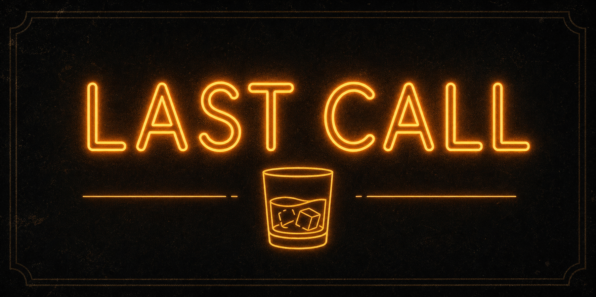

<div align="center">


# 🥃 whisky-finish

**모든 작업의 끝에는 한 잔이 있다.**

에이전트가 일을 끝내면, 이번 작업에 어울리는 위스키를 골라 한 잔 따르고<br/>
테이스팅 노트를 남기는 마무리 리추얼 스킬.

`Nose` · `Palate` · `Finish` — 코드도, 위스키도, 끝맛이 전부다.

</div>

---

## 왜?

밤새 에이전트를 돌리다 보면 두 가지가 사라진다. **마무리의 감각**, 그리고 **"이 세션 끝난 건가?"에 대한 답**.

whisky-finish는 둘 다 돌려준다. 작업이 끝나면 잔을 채우고, 세션이 끝나면 종을 울린다.

## 뭘 하는 스킬인가

### 1. The Pour — 작업 끝, 한 잔

작업이 마무리되면 에이전트가 **이번 작업의 성격에 맞는 실제 위스키**를 골라 따른다. 그리고 NPF 테이스팅 노트를 쓴다 — 절반은 위스키, 절반은 회고.

> ## 🥃 Dram #3 — Lagavulin 16 (43%)
> *2026-07-29 · after: job queue 레이스 컨디션*
>
> **Nose:** 스모크와 요오드 — 새벽 2시 프로드 장애의 냄새. 다만 해결된 냄새.<br/>
> **Palate:** 묵직한 피트, 그 아래 건과일. 버그는 추했지만 픽스는 mutex 하나였다.<br/>
> **Finish:** 아주 길고 따뜻하다. 남겨둔 리그레션 테스트도 그렇다.
>
> **Verdict:** 91/100. 마실 자격 있음.

페어링은 진지하다:

| 작업 | 잔 |
|---|---|
| 지옥 같은 디버깅 | 피트 폭탄 Islay — Laphroaig 10, Ardbeg Uigeadail |
| 우아한 리팩터링 | 정갈한 Speyside — Balvenie DoubleWood 12 |
| 스피드 핫픽스 | 하이라이 버번/라이 — Wild Turkey 101, Rittenhouse |
| 그린필드 시작 | 젊고 팔팔한 — Kilchoman Machir Bay, Arran 10 |
| 기나긴 마이그레이션 | 셰리 밤 — GlenDronach 15, A'bunadh |
| 어쩌다 성공한 괴상한 핵 | 괴상한 것 — Octomore, Amrut, Chichibu |

모든 잔은 **존나 구체적**이다 — 증류소, 익스프레션, 도수, 캐스크 구성, 배치 넘버까지. "적당한 Islay" 같은 건 이 바에 없다. 그리고 모든 잔은 `.whisky/tab.md` — **바 탭**에 기록된다.

위스키 초보라면? 바텐더가 눈높이를 맞춘다. 가쿠빈 하이볼 1:4, 얼음 꽉 채운 롱글라스, 레몬 필 — 하이볼도 정식 서브다.

### 2. The Bar — 인터랙티브 위스키 상담

궁금한 건 뭐든 바텐더에게. 지역, 증류소, 캐스크, 입문 추천, NPF 읽는 법.

```
> Islay 입문용 뭐가 좋음?
> 셰리 캐스크가 정확히 뭘 하는 건데?
> 한 잔 더
```

**"한 잔 더"** 하면 새 병으로 다음 잔을 따르고, 탭에 번호가 하나 올라간다.

### 3. Last Call — 세션 마감

<div align="center"></div>

세션을 너무 많이 돌리다 보면 헷갈린다. *이거… 끝난 세션인가?*

이제 종을 울리면 된다:

```
> last call
```

`.whisky/LAST-CALL.md`가 기록된다 — 마감 시각, 마신 잔 수, 마지막 잔, 이 세션에서 한 일 한 줄. 나중에 누가 (사람이든 에이전트든) 이 세션이 끝났는지 물으면, 이 파일이 답한다.

> *This session is over. The bar is closed.*

## 설치

```bash
# skills CLI로 (권장 — skills.sh 생태계)
npx skills add choism4/whisky-finish

# 또는 직접 클론 (개인 스킬로, 모든 프로젝트에서 바 오픈)
git clone https://github.com/choism4/whisky-finish ~/.claude/skills/whisky-finish
```

## 남는 것들

```
.whisky/
├── tab.md          # 바 탭 — 세션별, 잔별 테이스팅 노트 전체 기록
└── LAST-CALL.md    # 마지막 마감 기록 — "이 세션 끝났나?"의 답
```

---

<div align="center">

*음주는 21세부터. 에이전트는 나이가 없으므로 무제한.*

🥃

</div>
