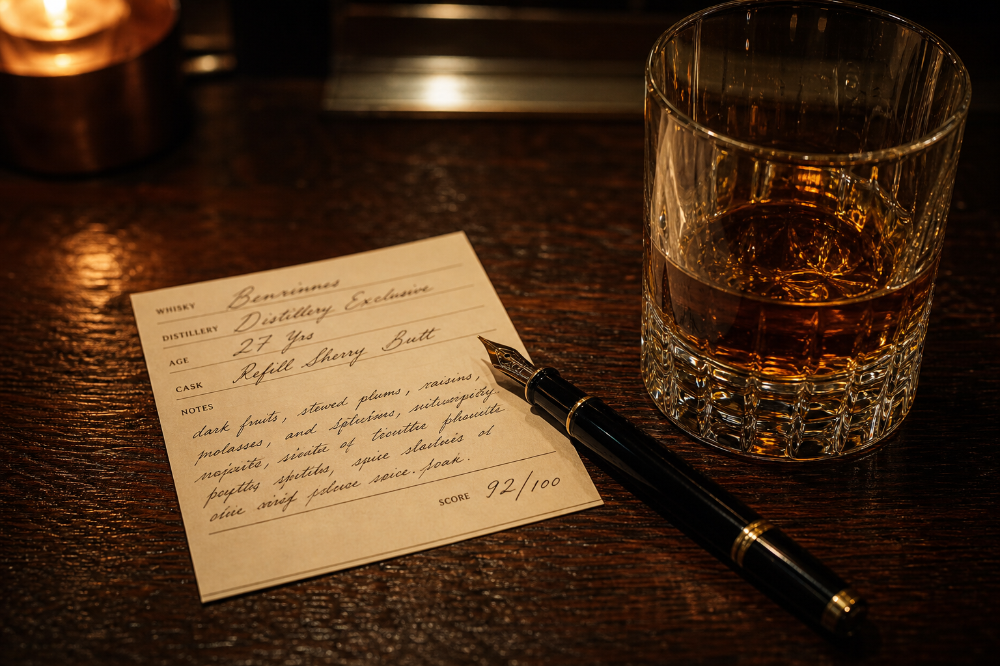
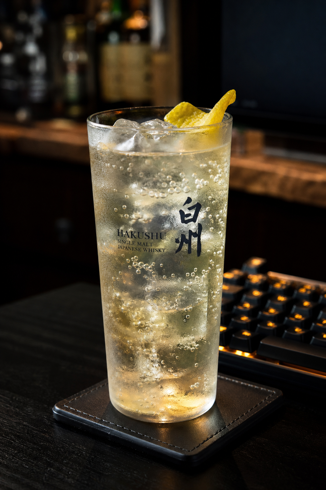
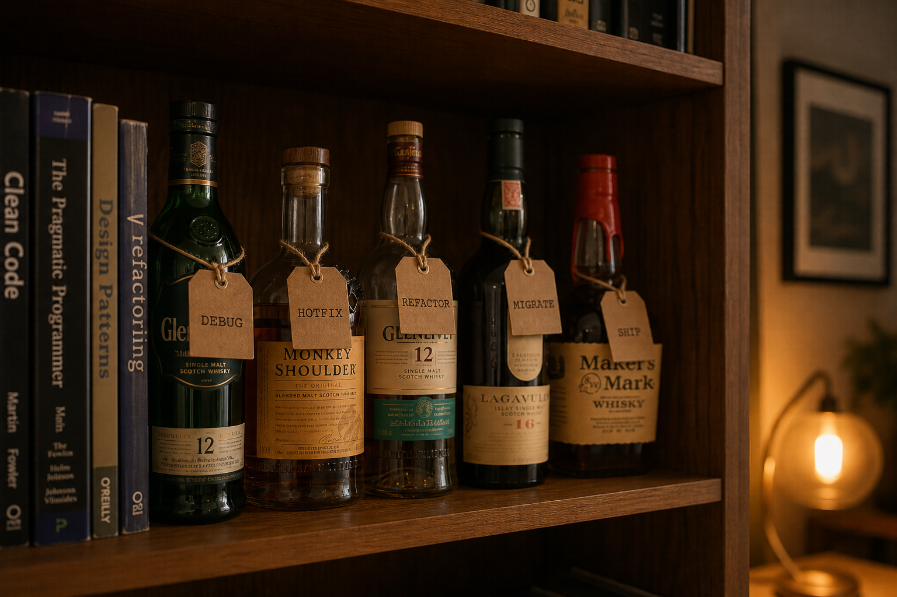

<div align="center">


# 🥃 whisky-finish

**Clock out. Come home. Pour one.**

When the work is done, your agent picks a whisky that matches the job,<br/>
pours a quiet dram at home, and writes the tasting note.

`Nose` · `Palate` · `Finish` — for code and whisky alike, the finish is everything.

```bash
npx skills add choism4/whisky-finish
```

One command. Ten seconds. Works with **Claude Code, Cursor, Codex, Gemini CLI, Windsurf, Copilot — 70+ agents**.

[](https://skills.sh/choism4/whisky-finish)
[](#works-with)
[](LICENSE)

</div>

---

## Why

Run enough agent sessions overnight and two things go missing: **the sense of an ending**, and **the answer to "wait — did this session finish?"**

whisky-finish brings both back. Not a bar, no crowd, no neon — just the one glass you pour for yourself at home when the day is actually over. When the work ends, the glass gets filled. When the session ends, the lamp goes off.

## What it does

### 1. The Pour — work's done, pour one

When a task wraps up, the agent picks a **real, specific bottling** that matches the character of the work — then writes an NPF tasting note: half whisky, half retrospective.

<div align="center"></div>

> ## 🥃 Dram #3 — Ardbeg Uigeadail (54.2%, NAS, ex-bourbon + oloroso, NCF)
> *2026-07-29 · after: race condition in the job queue · neat, Glencairn, 3 drops of water*
>
> **Nose:** Tarry rope and sherry-soaked raisins — a prod incident at 2am, but one that ends well.<br/>
> **Palate:** Oily, ashy peat over dark fruit. The bug was ugly; the fix was one mutex.<br/>
> **Finish:** Endless, warm, faintly sweet. So is the regression test left behind.
>
> **Verdict:** 92/100. Earned.

There is no pairing chart. The agent reads the session — the weight of it, the pain, the elegance, how long it dragged — and pours on instinct. A hellish debugging night might land on a peat monster; a clean refactor on something precise and waxy; a weird hack that somehow worked on something equally weird. Or not. That's the pourer's call, and the tasting note is where the call gets defended.

Every pour is still **uncompromisingly specific** — distillery, expression, ABV, cask program. There is no "some nice Islay" on this shelf. And every pour lands in the journal: one global `~/.claude/tab.sqlite`, never your repo.

New to whisky? It meets you where you are. A Kakubin highball 1:4, tall glass packed with ice, lemon peel — a highball is a first-class serve here, not a downgrade.

<div align="center"></div>

### 2. The Shelf — ask anything, over a glass

<div align="center"></div>

Regions, distilleries, cask chemistry, entry-level ladders, how to read a label — answered like a friend who knows the shelf well. And when you say **"one more"** — a new bottle comes down, and the journal gets one more entry.

```
> what's a good starter Islay?
> what does a sherry cask actually do?
> one more
```

### 3. Closing the session — mark it finished

<div align="center"></div>

Run enough sessions and it gets blurry. *Is this one... finished?*

Now the night has a proper end:

```
> close the session
```

This records the close — time, drams poured, the final pour, and a one-line summary of what got done — in the journal. Later, when anyone (human or agent) asks whether this session ended, the journal answers.

> *This session is over. The glass is washed, the bottle is corked, the lamp is off.*

## Install

One command, no config, nothing to edit:

```bash
npx skills add choism4/whisky-finish
```

The [skills CLI](https://skills.sh) detects your agents and installs everywhere at once. Non-interactive, all agents:

```bash
npx skills add choism4/whisky-finish --all
```

Prefer plain git? Clone it as a personal skill — every project gets the ritual:

```bash
git clone https://github.com/choism4/whisky-finish ~/.claude/skills/whisky-finish
```

## Works with

Anything the skills CLI speaks — **70+ agents**, including:

**Claude Code** · **Cursor** · **Codex** · **Gemini CLI** · **GitHub Copilot** · **Windsurf** · **Amp** · **Goose** · **OpenCode** · **Cline** · **Roo Code** · **Zed** · **Warp** · **Droid** · **Devin** · **OpenHands** · **Trae** · **Kilo Code** · **Continue** · **Junie** … and the rest of the [skills.sh](https://skills.sh) ecosystem.

No agent-specific setup. The skill is a single `SKILL.md` — if your agent reads skills, it reads this one.

## What's left behind

**Nothing in your repo.** All state lives in one global journal:

```
~/.claude/tab.sqlite    # every pour, every note, every session close — across all projects
```

No dotfiles, no journal committed by accident, nothing to `.gitignore`. Delete a worktree the moment you're done with it — the night it held stays on the record.

## FAQ

**What is whisky-finish?**
An agent skill that adds an end-of-work ritual to AI coding agents: after finishing a task, the agent picks a real whisky bottling that matches the work, writes a Nose/Palate/Finish tasting note, and logs it. It also answers whisky questions (recommendations, regions, casks, highballs) and marks sessions as finished.

**How do I know if an old agent session actually ended?**
Say "close the session" — the skill records the close time and a one-line summary in the global journal (`~/.claude/tab.sqlite`), a persistent session-end marker any human or agent can check later, keyed by project path.

**Does the agent actually know whisky?**
Near-expert level: real bottlings with distillery, ABV, and cask program; real flavor profiles; proper serves including highball builds. Beginners get approachable pours and plain-language explanations, not Octomore.

**Which agents does it support?**
Claude Code, Cursor, Codex, Gemini CLI, GitHub Copilot, Windsurf, and 70+ more — anything installable via `npx skills add choism4/whisky-finish`.

**Is this a real drink?**
The agent's dram is fictional. Yours is your business. Drink responsibly.

---

<div align="center">

*Drinking age is 21. Agents have no age, so no limit.*

🥃

</div>
